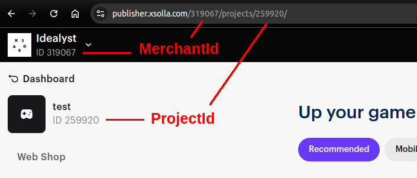

# Xsolla API Integration Example

## Setup Instructions

### 1. Copy `.env.example` to `.env`
```bash
cp .env.example .env
```
Next, fill in the necessary values in the .env file

Project ID can be found in your Xsolla Publisher Account.


### 2. Start the Docker Containers
```bash
docker-compose --env-file ./.env -f docker/docker-compose.yml down --remove-orphans
docker-compose --env-file ./.env -f docker/docker-compose.yml up --build
```
The application will be running on http://localhost:8091

### 4. Set "API" integration in project settings
In you Xsolla Publisher Account -> your project -> Project settings -> Webhooks  
OR open the page: https://publisher.xsolla.com/<YOUR_MERCHANT>/projects/<YOUR_PROJECT>/edit/webhooks/

Your should set "API" integration instead of "Webhooks" integration. 

+ set "add order object to webhook" setting

### 5. Create a product in Publisher Account
In your Xsolla Publisher Account -> your project -> store -> virtual items -> add item
OR open the page: https://publisher.xsolla.com/<YOUR_MERCHANT>/projects/<YOUR_PROJECT>/storefront/virtual-items
and create a product.

### 6. Create login project
In your Xsolla Publisher Account -> your project -> Login -> New login project
Or open the page: https://publisher.xsolla.com/<YOUR_MERCHANT>/projects/<YOUR_PROJECT>/login

And copy your Login ID to .env

+ change "JWT signature" -> "RS256"

### 7. Make a test payment
And open http://localhost:8091/

Payment process:
1. as client: push button "Auth" -> login -> for get auth token (field "User token" will be filled)
2. as game-client: generate json data for payment -> redirect client to payment page
3. as client: make a payment
4. as game-client: receive a webhook of payment result and provide a customer with a product 